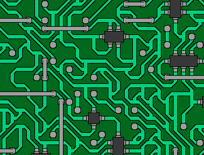
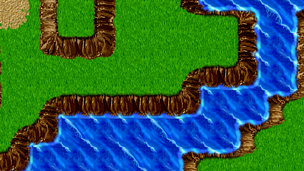

# Wave Function Collapse

High-performance Rust implementation of the Wave Function Collapse algorithm for procedural image generation. Available as both a native CLI application and a WebAssembly library for browser usage.

## What it does

Wave Function Collapse analyzes patterns in an input image and generates new images that locally resemble the original while creating novel, larger compositions. The algorithm extracts small tile patterns from the input, learns adjacency rules, and uses constraint propagation to generate coherent output.

## Native Usage

Generate an image from a pattern:
```sh
cargo run --release -- images/circuit-1-57x30.png -i 14 -o 50x50 output/circuit-1.png
```

Visual mode (real-time generation):
```sh
cargo run --release -- images/circuit-1-57x30.png -i 14 -o 50x50 --visual
```

## Web/WASM Usage

### Building for the Web

1. Install wasm-pack:
```sh
curl https://rustwasm.github.io/wasm-pack/installer/init.sh -sSf | sh
```

2. Build the WASM package:
```sh
wasm-pack build --target web --features wasm --no-default-features
```

3. Serve the HTML demo:
```sh
# Using Python
python -m http.server 8000

# Using Node.js
npx http-server .

# Using Rust
cargo install basic-http-server
basic-http-server .
```

4. Open `http://localhost:8000` in your browser and load `index.html`

### Using the WASM Library

```javascript
import init, { WfcGenerator } from './pkg/wave_function_collapse.js';

await init();

// Create generator from input image
const generator = new WfcGenerator(
    inputImageData,  // ImageData from canvas
    tileSize,        // Size of tiles to extract (e.g., 3)
    outputWidth,     // Output width in tiles (e.g., 30)
    outputHeight,    // Output height in tiles (e.g., 20)
    seed             // Optional random seed
);

// Initialize canvas renderer
generator.init_renderer(canvasWidth, canvasHeight);

// Generate step by step with visualization
while (!generator.is_done()) {
    generator.step();
    generator.render(showDebug);
}

// Get final result
const outputImageData = generator.get_output_image_data();
```

## Feature Flags

- `cli` (default): Enables command-line interface with file I/O and progress bars
- `image` (default): Enables image processing, serialization, and text rendering
- `sdl2` (default): Enables visual mode with real-time generation display
- `wasm`: Enables WebAssembly bindings and browser compatibility
- `threaded`: Enables parallel processing for faster generation

Build with specific features:
```sh
# Native CLI build (default)
cargo build --release

# WASM build
cargo build --release --target wasm32-unknown-unknown --features wasm --no-default-features

# Fast native build without visualization
cargo build --release --features "image,threaded,cli" --no-default-features

# Minimal library build
cargo build --release --no-default-features --features "image"
```

## Examples

### Circuit Generation
Input: `images/circuit-1-57x30.png`
```sh
cargo run --release -- images/circuit-1-57x30.png -i 14 -o 25x19 examples/circuit-example.png
```
Creates complex electronic circuit patterns with proper connectivity.



### Summer Landscape
Input: `images/summer-1-16x9.png`
```sh
cargo run --release -- images/summer-1-16x9.png -i 8 -o 64x36 examples/summer-example.png
```
Generates natural landscape variations with smooth transitions.



## Installation

Requires Rust and SDL2 development libraries.

```sh
cargo build --release
```

## License

CC0 (Public Domain)
