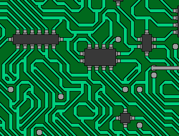
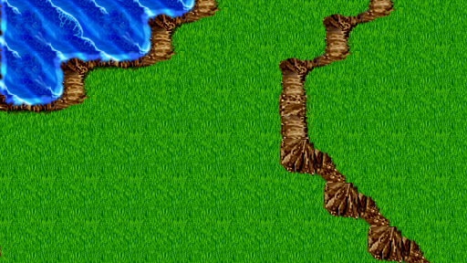

# Wave Function Collapse

Wave function collapse over a tile set, as a Rust library, a command line image
generator, and a WebAssembly solver a JavaScript or TypeScript host can drive.

Give it a set of tiles and which tiles may sit against which, and it fills a grid so
that every neighbouring pair obeys those rules. Point it at a sample image instead
and it works the tile set out for itself, cutting the image into a grid and reading
adjacency from which tiles touch, so the output resembles the sample everywhere close
up while being new at any larger scale.



## Layout

| Package | What it is |
| --- | --- |
| [`crates/wave-function-collapse`](crates/wave-function-collapse) | The algorithm. Six dependencies, no image handling, no I/O. |
| [`crates/wfc-cli`](crates/wfc-cli) | The `wfc` command. Sample images, tile configs, PNG output, a live SDL2 view. |
| [`crates/wfc-wasm`](crates/wfc-wasm) | The solver as a JavaScript module. Tile definitions in, grid state out. |

A tile carries a value of any type that the algorithm never reads, so what a tile
*is* belongs to whoever is using it: a `DynamicImage` for the command line tool, `()`
for the wasm solver, whatever suits a caller of the library.

## The command line tool

```sh
cargo install --path crates/wfc-cli
```

Needs SDL2 for the live view. Build with `--no-default-features` to skip it.

Cut a sample image into 14 pixel tiles and fill a 50 by 50 grid:

```sh
wfc images/circuit-1-57x30.png -i 14 -o 50x50 circuit.png
```

Watch it collapse in a window instead of writing a file:

```sh
wfc images/circuit-1-57x30.png -i 14 -o 50x50 --visual
```

`-i` has to match the sample's tile size or the tiles come out as noise. The sample
file names carry the grid, so `castle-115x30.png` at 805 by 210 pixels wants `-i 7`.

Pass `--seed` to reproduce a result, `--slow` to redraw after every step, and
`--max-restarts` to change how long it tries before giving up on a tile set that may
not be able to fill the grid. `wfc --help` has the rest.

A tile set can also be written out by hand, as JSON naming an image and four edge
labels per tile, in up, right, down, left order. Two tiles may sit beside each other
when the label on the side that touches reads as the reverse of the other's. These
two therefore alternate, since neither label reverses to itself:

```json
[
    { "image": "tiles/light.png", "slots": ["ab", "ab", "ab", "ab"] },
    { "image": "tiles/dark.png",  "slots": ["ba", "ba", "ba", "ba"] }
]
```

```sh
wfc tiles.json -o 40x40 pipes.png
```

## The library

```toml
[dependencies]
wave-function-collapse = "2"
```

Nothing optional, nothing to turn off, and no image or CLI dependency to inherit.

```rust
use std::sync::Arc;
use wave_function_collapse::{Grid, Neighbors, Set, SuperState, Tile, Wave};

// Land never touches sea; shore goes between. The rules have to read the same
// from both sides, or nothing can satisfy them.
let tiles: Vec<Tile<&str>> = [
    ("land", 0u64, [0, 1].as_slice()),
    ("shore", 1, &[0, 1, 2]),
    ("sea", 2, &[1, 2]),
]
.into_iter()
.map(|(name, id, allowed)| {
    let allowed: Set<u64> = allowed.iter().copied().collect();

    Tile::with_neighbors(id, name, 1, Neighbors::from_fn(|_| allowed.clone()))
})
.collect();

let base = SuperState::new(tiles.into_iter().map(Arc::new).collect());
let grid = Grid::new(40, 24, &mut |_, _| base.clone());
let mut wave = Wave::new(grid, 20260903);

wave.run(100);
assert!(wave.done(), "gave up after {} restarts", wave.restarts());

for (x, y, cell) in wave.grid().iter() {
    let tile = cell.collapsed().expect("a finished wave has no open cell");

    println!("({x}, {y}) is {}", tile.value);
}
```

`run` takes a restart budget because a tile set that cannot tile the grid would
otherwise restart forever. To own the loop instead, call `step(limit)` for a bounded
amount of work and read the grid between calls; `done`, `remaining`, `restarts` and
`base_entropy` say where it has got to.

`threaded` is the one feature, and spreads the possibility filter over threads with
rayon. It helps on large tile sets and costs on small ones.

## The wasm solver

The module is the algorithm and nothing else: 47 KB gzipped, no image decoding, no
canvas, no DOM. It takes tile definitions as indices and weights, and hands back
which tile landed in each cell, so the host decides what a tile looks like and owns
its own render loop.

```sh
cd crates/wfc-wasm/www
npm install
npm run dev
```

That builds the module with `wasm-pack` and serves a demo that draws its tiles on a
canvas: [`www/src/tiles.ts`](crates/wfc-wasm/www/src/tiles.ts) turns edge labels into
the adjacency the solver wants, and
[`www/src/main.ts`](crates/wfc-wasm/www/src/main.ts) is the loop.

```ts
import init, { Solver, randomSeed } from "./pkg/wfc_wasm";

await init();

// Two tiles, each allowed against either, drawn equally often.
const solver = new Solver(
    [
        { up: [0, 1], right: [0, 1], down: [0, 1], left: [0, 1] },
        { up: [0, 1], right: [0, 1], down: [0, 1], left: [0, 1], weight: 3 },
    ],
    40,
    24,
    randomSeed(),
);

const frame = () => {
    const done = solver.stepFor(8);
    const cells = solver.cells();

    for (const cell of solver.dirtyCells()) {
        const x = cell % solver.gridWidth;
        const y = Math.floor(cell / solver.gridWidth);

        paint(x, y, cells[cell]);   // -1 while the cell is still open
    }

    if (!done) requestAnimationFrame(frame);
};

requestAnimationFrame(frame);
```

`stepFor` never runs longer than the milliseconds it is given, so the frame stays
yours. `cells` is the tile index per cell and `entropy` is how many possibilities
each still has, which divided by `baseEntropy` shades a cell by how far it has
narrowed down. `dirtyCells` lists what the last step changed, so a redraw touches a
handful of cells rather than the grid. Types come from the generated `.d.ts`.

Errors arrive as ordinary JavaScript exceptions: an empty tile set, a neighbour index
that does not exist, a tile with a side nothing may sit against, a zero-sized grid.

## Examples

Circuits, from `images/circuit-1-57x30.png` at `-i 14`:

```sh
wfc images/circuit-1-57x30.png -i 14 -o 25x19 examples/circuit-example.png
```


Landscape, from `images/summer-1-16x9.png` at `-i 8`:

```sh
wfc images/summer-1-16x9.png -i 8 -o 64x36 examples/summer-example.png
```



Sample images come from
[mxgmn/WaveFunctionCollapse](https://github.com/mxgmn/WaveFunctionCollapse) and from
video games; see [`images/README.md`](images/README.md).

## Benchmarks

```sh
cargo bench -p wave-function-collapse
```

[`BENCHMARKS.md`](BENCHMARKS.md) covers what they measure and how to add more.

## License

CC0, public domain.
